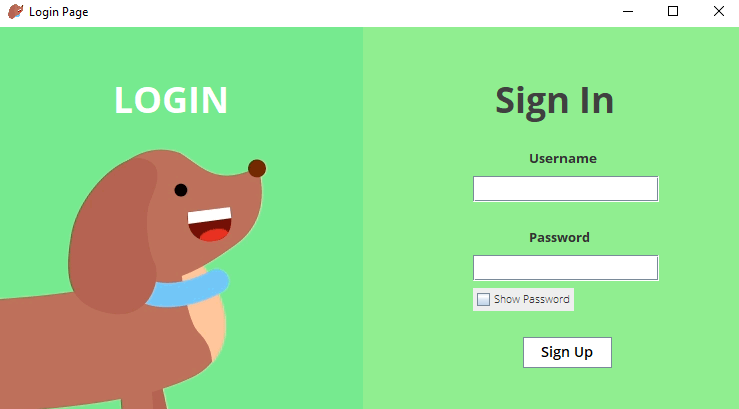
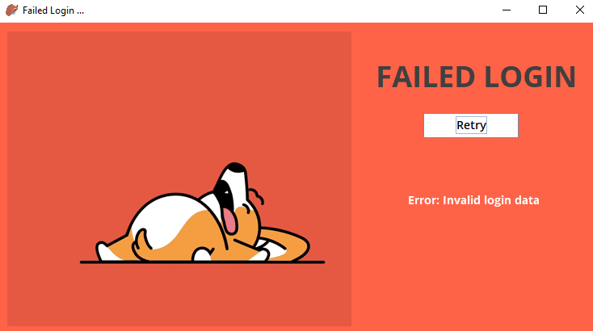
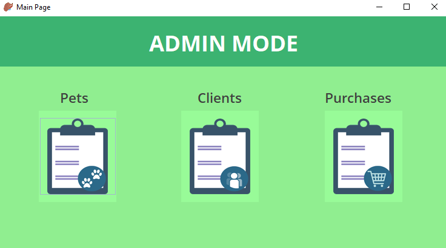
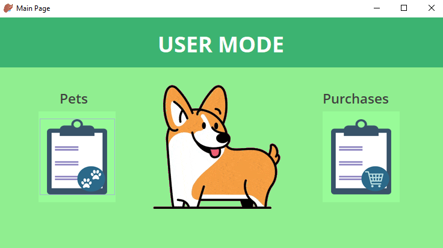

## 🐶 Pet Inventory 🐱

 > Pets inventory with SQL and Java.

 ***

### 📄 About 

Created for the final project of DAW **(Web Application Development)**. 

### 📋 Features

You can login as **Client** or **Admin**. 

>_Administrator can :_
* Add pets / users / purchases
* Update pets / users / purchases
* Delete pets / users / purchases
* List pets / users / purchases

>_Client can :_
* List pets / **own** purchases

#### Extra

1. Tables to show data.
2. Search bar.
3. Order by values.

 ***
### 📷 Templates

### 🧪 Technologies

Used [MySQL](https://dev.mysql.com/doc/ "MySQL Documentation") and [Java](https://docs.oracle.com/en/java/ "Java Documentation").

> Used libraries

**Java**

* _javax.swing_
* _java.awt_
* _java.sql_
* _java.io.File_
* _javax.sound.sampled_
* _java.util_

### 🚀 Launch

Only you need its **compile** and **run** the file _Main.java_.

