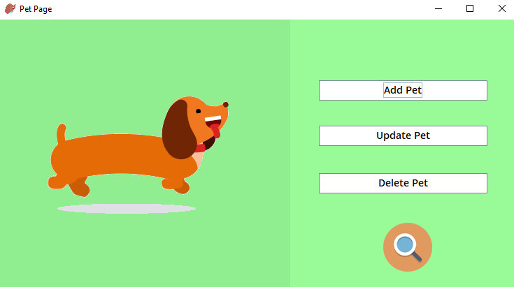
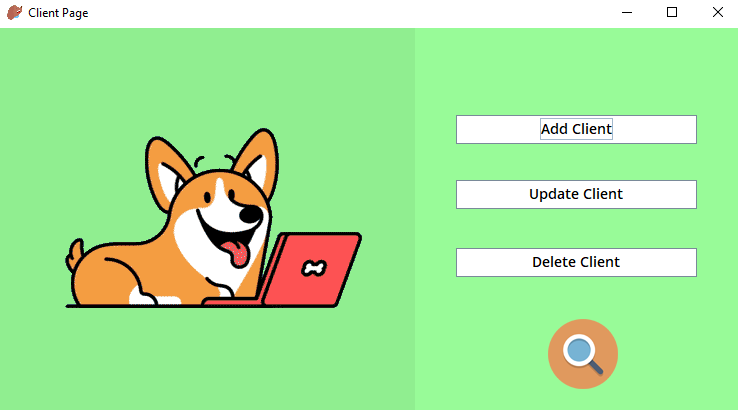
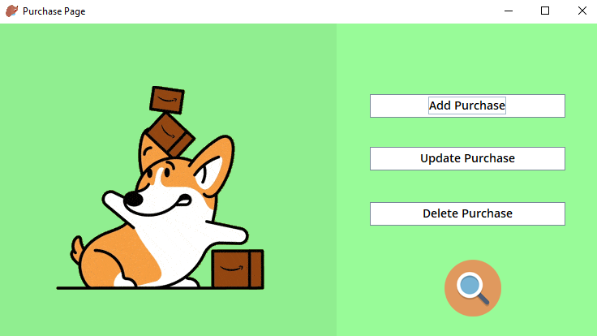

## 🐶 Pet Inventory 🐱

 > Pet inventory with SQL and Java.

 ***

 

    <h3>🐾 [ Pet Inventory ] 🐾<h3>
    <h5>Check it in ✅</h5>
    <h3>
        <a href="https://view.genial.ly/60990384cffc8f0d31be023c/presentation-pet-inventory-presentacion">
            Genial.ly
        </a>
         | 
         <a href="https://replit.com/@le4nnt0nn/PetInventoryProject">
            Replit
        </a>
         | 
         <a href="https://youtu.be/6GEuHPwKSME">
            VideoDemo
        </a>
    </h3>

***

### 📄 About 

Created for the final project of DAW **(Web Application Development)**. 

### 🚀 Launch

Only you need its a database and **compile** and **run** the file _Main.java_.

**Demo Admin**
* User : admin
* Password : root

**Demo Client**
* User : rodri18
* password : rodri

***

### 🧪 Technologies

Used [MySQL](https://dev.mysql.com/doc/ "MySQL Documentation") and [Java](https://docs.oracle.com/en/java/ "Java Documentation").

> Used libraries

**Java**

* _javax.swing_
* _java.awt_
* _java.sql_
* _java.io.File_
* _javax.sound.sampled_
* _java.util_

### 📋 Features

You can login as **Client** or **Admin**. 

>_Administrator can :_
* Add pets / users / purchases
* Update pets / users / purchases
* Delete pets / users / purchases
* List pets / users / purchases

>_Client can :_
* List pets / **own** purchases and **export** them in a file.

#### Extra

1. Tables to show data.
2. Search bar.
3. Order by values.
4. Implemented sounds.

 ***
 
### 📷 Templates

#### Login

#### Admin

#### User

